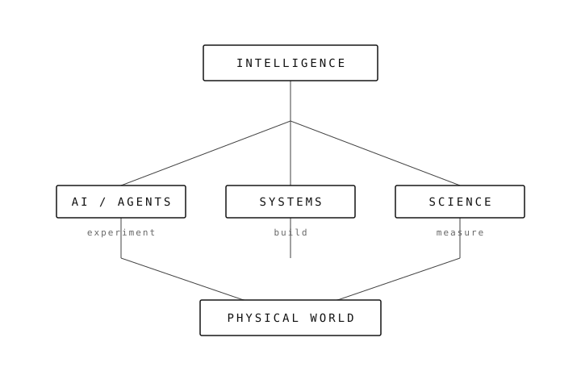

<picture>
  <source media="(prefers-color-scheme: dark)" srcset="assets/header-dark.svg" />
  
</picture>

# MITFELLOW

**Building systems to understand intelligence.**

I'm an engineer and independent builder working on AI systems, agents, and experiments around intelligence, automation, and the physical world. Most of what interests me starts as a question and becomes something I can build. Current focus, per my bio: building an AI workforce.

---

## Principles

| | |
|---|---|
| **BUILD** | Understand by making. |
| **QUESTION** | Don't accept abstractions without looking underneath. |
| **EXPERIMENT** | Turn ideas into systems that can be tested. |
| **ITERATE** | A working experiment beats a perfect idea. |

---

## Currently building

### 01 — AI worker platform

*One-line purpose:* an AI system that connects to the real environment of a person or organization and performs long-running work across its systems.

**What it is:** early design work on long-running agents — memory, verification, and improvement of their own work — rather than single-prompt demos.

**Why I'm building it:** most agents answer; few can be trusted with real, sustained work inside unfamiliar environments.

**Current state:** design and early scaffolding. No public repo yet.

### 02 — Ceres, desktop AI agent

**What it is:** a desktop agent application (Electron, JavaScript) with a full installer pipeline — Windows setup wizard and portable build, plus macOS and Linux targets.

**Why it exists:** to study what an agent needs once it lives on a real machine instead of a chat window.

**Current state:** working scaffold; installer builds, agent behavior early.

**Repository:** [HeliosLabAI/Ceres](https://github.com/HeliosLabAI/Ceres)

### 03 — Agent platform frontend

**What it is:** a full-stack agent-platform frontend (TypeScript, React, Vite, Tailwind) — the control surface an AI workforce would need.

**Why it exists:** agents need inspectable interfaces, not black boxes.

**Current state:** early scaffold.

**Repository:** [HeliosLabAI/superagent-full-stack](https://github.com/HeliosLabAI/superagent-full-stack)

### 04 — This profile and site

**What it is:** this page and [mitfellow.github.io](https://mitfellow.github.io/) — plain HTML/CSS, no build step, no stats widgets.

**Why it exists:** a public notebook has to load fast and read clearly.

**Repositories:** [MITfellow/MITfellow](https://github.com/MITfellow/MITfellow) · [MITfellow/MITfellow.github.io](https://github.com/MITfellow/MITfellow.github.io)

---

## Questions I'm working on

- How does intelligence emerge from simple systems?
- Can AI systems learn to operate inside unfamiliar environments?
- What must an AI worker understand before it can reliably perform real work?
- How can machines learn from interaction rather than static datasets?
- How does intelligence move from software into the physical world?
- How should long-running AI systems remember, verify, and improve their work?

---

## Experiments

### EXP 001 — Desktop agent runtime (Ceres)

**Question:** what breaks first when an agent lives on a machine, not in a demo?

**Method:** Electron shell, agent loop in `agent.js`, packaged with electron-builder; build logs kept in-repo.

**Result:** installer and portable builds work; agent behavior is early and under test.

**Notebook:** [HeliosLabAI/Ceres](https://github.com/HeliosLabAI/Ceres)

### EXP 002 — Interface scaffolds (veritas-core, research-cockpit)

**Question:** what is the smallest honest surface for observing an agent?

**Method:** Vite + React + Tailwind scaffolds, iterated quickly.

**Result:** structure only — no claims beyond that.

**Notebooks:** [HeliosLabAI/veritas-core](https://github.com/HeliosLabAI/veritas-core) · [HeliosLabAI/research-cockpit](https://github.com/HeliosLabAI/research-cockpit)

---

## Research log

| | |
|---|---|
| **2026-09** | MITFellow profile and site — public notebook opens |
| **2026-08/09** | Agent platform frontend scaffold (HeliosLabAI) |
| **2026-04** | Ceres desktop agent with installer pipeline (HeliosLabAI) |
| **2026-03** | Early Vite/React interface scaffolds (HeliosLabAI) |

Dates are repository history, not milestones.

---

## Research map

<picture>
  <source media="(prefers-color-scheme: dark)" srcset="assets/research-map-dark.svg" />
  
</picture>

---

## Tools

I use whatever the work requires. What the repositories actually show:

- **Agent / app code:** JavaScript, TypeScript, React
- **Build / runtime:** Vite, Electron, Node.js
- **Interface:** Tailwind CSS, HTML, CSS
- **Practice:** Git, small commits, build logs kept in-repo

---

## Selected work

| Repository | What it is | Why it exists |
|---|---|---|
| [HeliosLabAI/Ceres](https://github.com/HeliosLabAI/Ceres) | Desktop AI agent, Electron + installer pipeline | Studies agents on real machines |
| [HeliosLabAI/superagent-full-stack](https://github.com/HeliosLabAI/superagent-full-stack) | Agent platform frontend, TS/React/Vite | Inspectable surface for agent work |
| [HeliosLabAI/veritas-core](https://github.com/HeliosLabAI/veritas-core) | Early interface scaffold | Smallest honest observation surface |
| [MITfellow/MITfellow.github.io](https://github.com/MITfellow/MITfellow.github.io) | This site, plain HTML/CSS | Public notebook, loads instantly |

Earlier work sits under [HeliosLabAI](https://github.com/HeliosLabAI); current identity is consolidating under [MITfellow](https://github.com/MITfellow).

---

## About

I'm Sameer Choudhary, an engineer and independent builder exploring AI, intelligent systems, and unusual computational ideas. Helios Lab is the open research direction behind some of the earlier experiments — early, unfinished, documented as it goes.

---

## Contact

[GitHub](https://github.com/MITfellow) · [Website](https://mitfellow.github.io/) · [X](https://x.com/MITfellow?s=20)

---

Still building.
